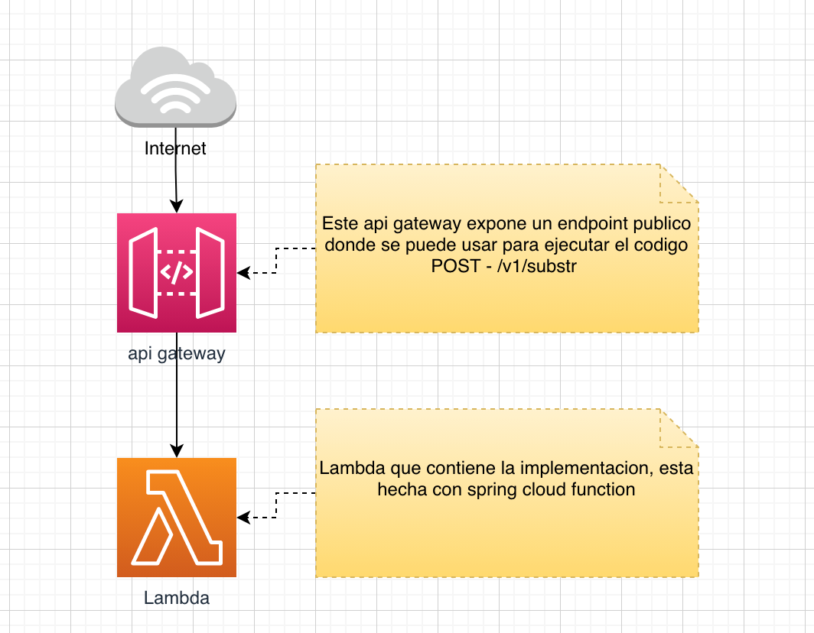
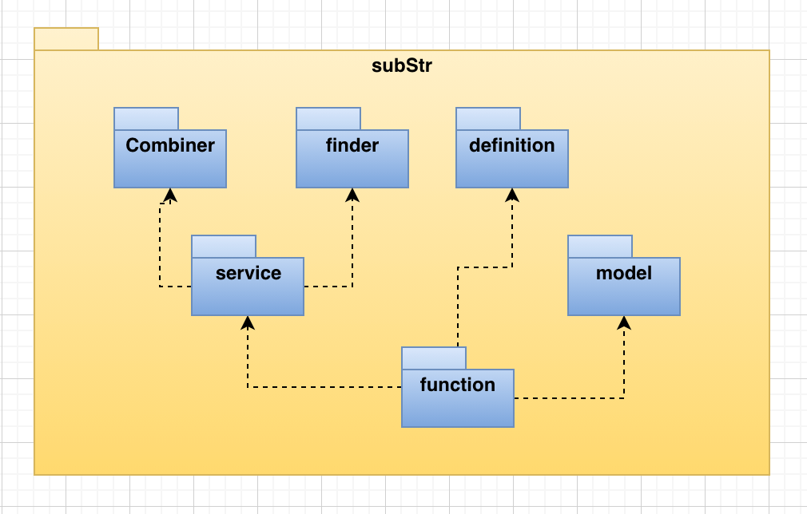
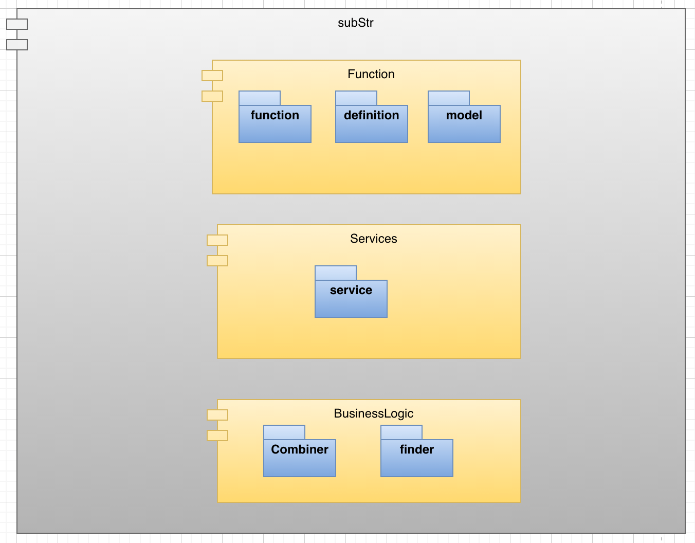

# Substrings and refactor

Se describe la informacion mas relevante del ejercicio.

### Descripcion 

En este repositorio hay 2 carpetas:

  |--- subStrings  
  |--- refactor
  
 La carpeta refactor tiene el codigo generado con base en el refactor solicitado.
 En la carpeta subStrings esta el codigo para solucionar el problema enunciado por correo.
 
 #### Despiegue
 
 
 
  #### Paquetes
 
 
  #### Capas
 
  
#### subStrings

 Este componente tiene el codigo del ejercicio entregado.
 
 
 Esta construido con:
  - Spring cloud function
  - Java 8
  - Lombok
  - AWS SDK
  - Junit
  - Mockito 
  - Gson
  - Gradle
  
   Para Desplegarlo hay que ejecutar el comando
   **./gradlew shadowJar** 
   
   En la carpeta **build/libs/** se va genera el jar que se debe desplegar 
   en la consola de aws, en las lambdas.
   
   Un ejemplo de jar generado es: build/libs/substr-2.0.0.RELEASE-aws.jar
   
#### Refactor
    
Este componente tiene el codigo de un proyecto spring con el refactor  a manera de propuesta.

Esta construido con:
 - Spring cloud function
 - Java 8
 - Lombok
 - Junit
 - Mockito 
 - Gson
 - Gradle
   
   
